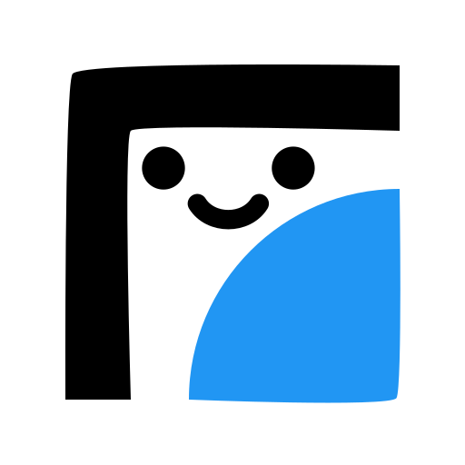
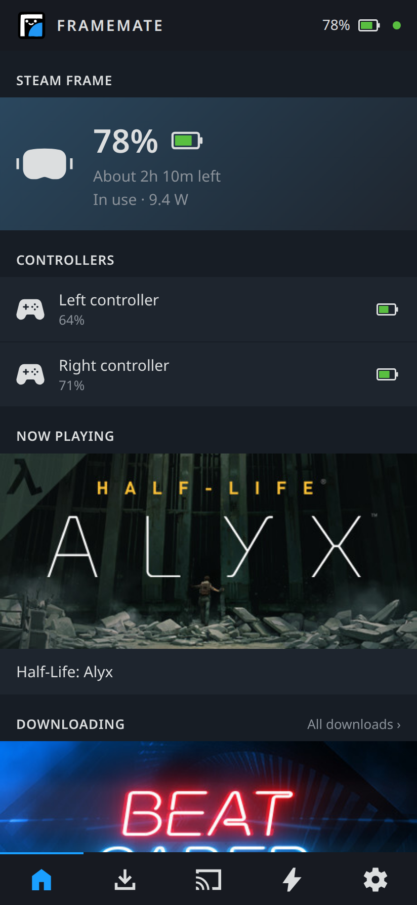
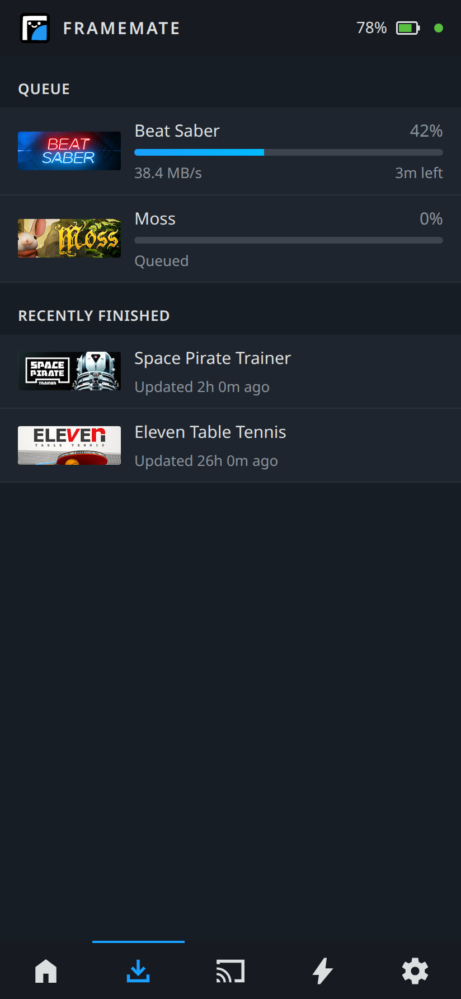
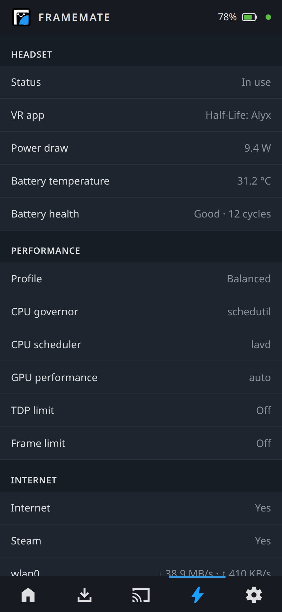
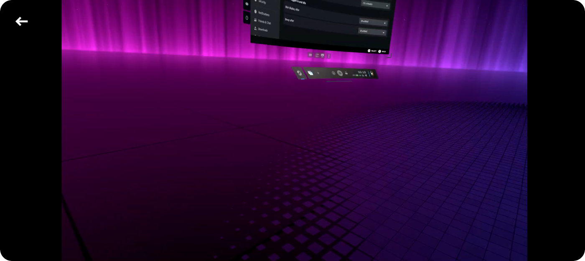

<p align="center">
  <picture>
    <source media="(prefers-color-scheme: dark)" srcset="assets/framemate-black.png">
    
  </picture>
</p>

<h1 align="center">FrameMate</h1>

<p align="center">
  A companion app for the <b>Steam Frame</b>: mirror the headset to your phone, keep an eye on battery, controllers, downloads and what's playing.
</p>

## At a glance

<p align="center">
  
  &nbsp;
  
  &nbsp;
  
</p>

## Mirroring

<p align="center">
  
</p>

FrameMate mirrors what the headset shows to your phone. Show your friends what
you're doing in VR, guide someone through their first session, or just check what's on
screen. The picture is the actual view in the headset, passthrough included. Encoded on using hardware acceleration to keep
the load low.

## Features

- **Headset battery** – the same percentage Steam shows in the headset, charging state,
  time left or time to full, and current power draw.
- **Controller batteries** – both controllers, including while they sleep (the last known
  level is remembered across restarts).
- **Now playing** – the running game with its Steam artwork.
- **Downloads** – the Frame's download queue with progress, speed and time left, plus recently
  finished updates. Downloads of your other PCs (Steam Remote Downloads) are left out.
- **Mirroring** – see above; also available in any browser.
- **System** – performance profile, CPU/GPU settings, network throughput, SteamOS and Steam
  client versions, battery temperature and health.
- **Web dashboard** – a plain-text status page on the Frame for any browser on your network.
- **Lightweight** – the agent on the Frame is a single static binary (~5 MB, a few MB of
  RAM) that idles at practically zero CPU.

## Installation

You need a Steam Frame and an Android phone on the same network.

### 1. Agent on the Steam Frame

The agent ships as a Flatpak. Open a terminal on the Frame (Desktop Mode → Konsole, or via SSH)
and run:

```sh
curl -LO https://github.com/nailuj05/framemate/releases/latest/download/framemate-agent.flatpak
flatpak install --user -y framemate-agent.flatpak
flatpak run dev.framemate.Agent install-service
flatpak run dev.framemate.Agent token
```

- `flatpak install` pulls the Freedesktop runtime from Flathub if it isn't installed yet
  (about 270 MB, once).
- `install-service` registers a user service, so the agent starts with every boot – in
  Game Mode too – and restarts it right away.
- `token` prints the access token (e.g. `MCK55-EGGCG`) you'll enter in the app.

To **update**, download the new `framemate-agent.flatpak` and run the first three commands
again. To **remove** it:

```sh
flatpak run dev.framemate.Agent uninstall-service
flatpak uninstall --user dev.framemate.Agent
```

### 2. App on your phone

1. Download `framemate.apk` from the [latest release](../../releases/latest) on your phone.
2. Open it and allow your browser/file manager to install apps when Android asks.
3. In the app's **Settings** tab, enter the Frame's address (`frame.local`, or its IP) and the
   token, then tap **Save & connect**.

### Web dashboard (Debug)

With the agent running, `http://frame.local:7380/?token=<your token>` shows a plain-text status
page in any browser, and `http://frame.local:7380/stream?token=<your token>` mirroring.

## Good to know

- **Unofficial.** FrameMate relies on undocumented Steam internals. A Steam or SteamOS update can
  break parts of it until the agent is updated. Tested on SteamOS 0.4.3 (beta branch).
- **Local network only.** The agent listens on port 7380 and talks plain HTTP/WebSocket, protected
  by the token. Don't expose that port to the internet. The connection isn't encrypted, so others
  on the same network could read the token and what's sent, including Mirroring. Use FrameMate on
  networks you trust, like your home Wi-Fi, not on public or shared ones.
- **Developer Mode.** FrameMate doesn't depend on it. Note that while it is on, SteamOS's devkit
  service exposes Steam's debugging interface to your whole network (port 8081); FrameMate never
  uses that port.
- **Battery percentage.** FrameMate shows the percentage Steam shows. The raw value of the
  battery gauge is lower (Steam scales it), so other tools may report a different number.

## Building from source

Requirements: Rust (with the `aarch64-unknown-linux-musl` target), Bun, Flatpak, and for the app
the Android SDK + NDK and JDK 21.

```sh
# Agent: static aarch64 binary → Flatpak bundle (no flatpak-builder or emulation needed)
rustup target add aarch64-unknown-linux-musl
scripts/flatpak.sh                  # → target/flatpak/framemate-agent.flatpak
scripts/flatpak.sh install          # build, install on the Frame via SSH, register the service

# Development loop: run the current build on the Frame without packaging
scripts/deploy.sh                   # scripts/deploy.sh logs | stop

# App
cd app
bun install
bun run tauri android build --apk --target aarch64
bun run tauri dev                   # desktop window for UI work
```

`scripts/*.sh` reach the Frame as `steamos@frame.local` (override with `FRAME_HOST`).

### Agent API

| Endpoint | |
|---|---|
| `GET /api/state` | full state as JSON |
| `GET /api/ws` | the same, pushed on every change |
| `GET /api/stream/ws` | mirroring: `{codec}` header, fMP4 init segment, one fragment per frame |
| `GET /` · `GET /stream` | web dashboard · mirroring player |

Authenticate with `?token=<token>` or `Authorization: Bearer <token>`.

## iOS Support

In theory this app should be able to be build for iOS aswell, I do not have the devices or infrastructure to build and test an iOS version. 
If you do and you want to contribute, please let me know!

## Future

- [ ] iOS Support
- [ ] TLS Support (self signed + pinning + QR pairing)
- [ ] PWA for the mobile client
- [ ] Feed on the App notifying you of newly frame verified games (in your library)
- [ ] Control Downloads (pause, resume, reorder)
- [ ] Turn off controller, headset, etc. 

## Credits

- Icons: [Material Symbols](https://github.com/google/material-design-icons) (Apache-2.0); see
  [`app/src/lib/icons/LICENSES.md`](app/src/lib/icons/LICENSES.md).
- Game artwork is loaded from Steam's public CDN.
- FrameMate Icon made by me

FrameMate is not affiliated with or endorsed by Valve. Steam, SteamOS and Steam Frame are trademarks of
Valve Corporation.
